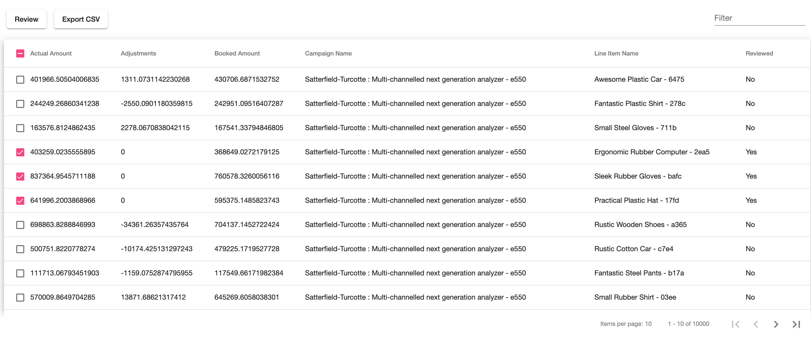

# Placements
Simple Angular app (single component) to render invoices. The `db.json` is provided by placements.io.



The following items from the requirement buckets has been implemented:
- Bucket 1
  - The user should be able browse through the line-item data as either a list or table.
  - The user should be able to sort the data.
  - The user should be able to output the invoice to *.CSV, *.XLS, etc.
  - The user should be able flag individual line-items as "reviewed"

- Bucket 2
  - The user should be able to filter the data

In addition to Angular framework, there are other packages to help us build this app:
- [Angular Material](https://material.angular.io/components/categories): Provides pre-built UI components.
- [ngrx](https://github.com/ngrx/platform): Angular state management using redux pattern & Observables.
- [json-devserver](https://github.com/typicode/json-server): Provides REST API for invoices in `db.json`.
- [file-saver](https://github.com/eligrey/FileSaver.js/): Provides solution to save file on the client side.

## Get Started
```bash
# Install packages
yarn install
```

The Angular is talking to a backend REST API provided by `json-devserver` (mentioned above).
This library is reading `db.json` in main directory and will provide a REST API for invoices on `localhost:3000`.
We need to start this API before we start the Angular app:
```bash
yarn start:backend # json-server db.json

# Above command will start the API on localhost:3000
# You can test this by hitting the following endpoint:
curl -i localhost:3000/invoices/1
# This should return invoice object where id is 1.
```

Now while this API is running, we need to start another terminal session in order to start the Angular app:
```bash
yarn start # ng serve

# Above command will start the Angular app on localhost:4200
# You can open your browser and go to that page
# You should see the very first 10 invoices that is stored in db.json

# Have fun!
```

## Implementation Details
Most of the code for this app is located in `src/app/invoice`, which is an Angular module.
This module has some directories that is common structure for `ngrx` modules:
- actions: Action files to help us dispatch invoice related action such as `adjust`
- components: Smart components that has access to store such as `invoice-table.component.ts`
- effects: Side effects that talks to services and make http calls
- models: Interfaces to help us with strong typing the objects such as invoice in this case.
- reducers: Reducers that are responsible for updating state
- services: Injectable files to help us make http calls in our effects.

The entry point for this app is `app.component` and this component is hosting `invoice-table` component.
You can checkout the template for this component `src/app/app.component.html` and
you should see a single component there called `app-invoice-table`.

This component is located in `src/app/invoice/components/invoice-table.component.[ts,scss,html]`, and
that's where all the magic for this app happens. The component is listening to some part of the state
using `store.select`. For example it is listening to invoices in state using:
`this.invoices = store.select(fromInvoices.getInvoices`.

The select will return an Observable (stream of data) that we can simply pipe it to `async` pipe in
the template. This help us to bind invoices object with table's `dataSource` asynchronous.
`<table [dataSource]="invoices | async> ` Now once `invoices` changes in state, the new data will be set to `dataSource`. Magic!

Almost all user actions with this component (paginate, filter, etc...) should cause an action to get
dispatched to store, and store will update the state using reducer and make necessary http calls using effects and services, and the component will get updated as state changes.

## Tests
There are some unit tests written for reducer, effects and services. You can checkout the specs files in relative directories. For example, for reducers you should find the spec file in:
`src/app/invoice/reducers/invoice.reducer.spec.ts`

You can run these specs using the following command:
```bash
yarn test # ng test

# This will start Karma to run the spec files.
```

## Improvements
- Add CI/CD integration
- Add log service
- Add global error handling for http errors
- Add http interceptor to log http calls
